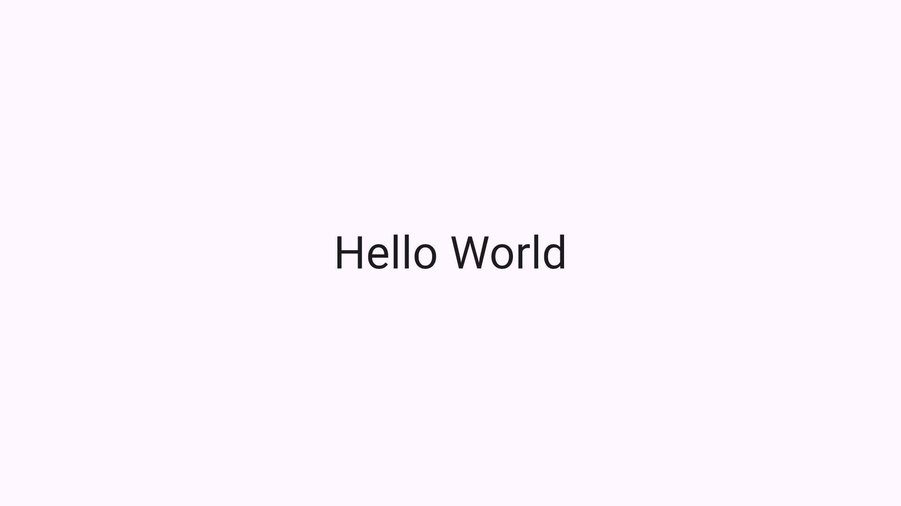
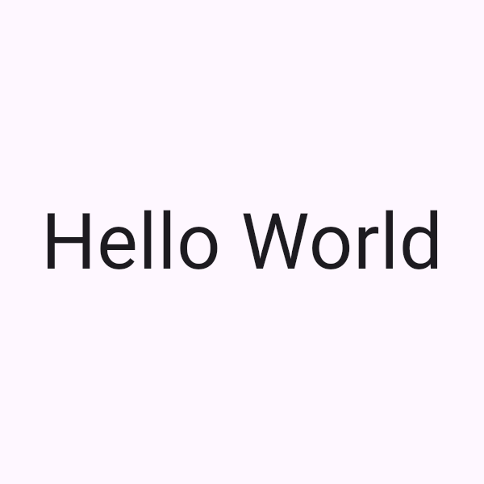
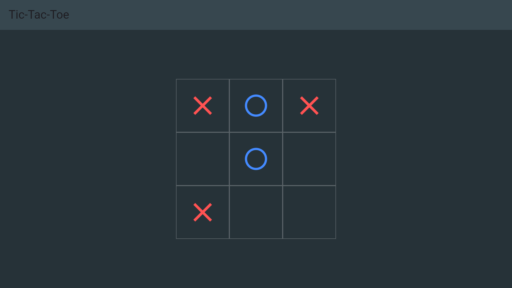

* ob-flutterui

This package allows you to render Flutter widgets using Emacs https://orgmode.org/worg/org-contrib/babel/intro.html[org-babel].

The inspiration for this package is Xenodium's https://github.com/xenodium/ob-swiftui[ob-swiftui] and the inspirations for that project.

* Flutter Setup

Assumming you already have http://flutter.dev[Flutter] installed. Create an empty project to use. We only need to add the pub package listed below and everything else is sorted at run-time by the script.

#+BEGIN_EXAMPLE shell
flutter create <project_name> --empty
flutter pub add golden_toolkit
flutter pub get
#+END_EXAMPLE

* Emacs Setup

Load the script and execute `ob-flutterui-setup`.

#+BEGIN_EXAMPLE elisp
;; (require 'ob-flutterui')
;; (load-file "<location>/ob-flutterui.el")
(load! "ob-flutterui") ;; if using a known path like doom config
(setq ob-flutterui-project-path "<project path>")
(ob-flutterui-setup)
#+END_EXAMPLE

* Usage

** Rendering a simple UI

The mininal UI will inject the content as the child of a =Center= widget.
Specifiying the filename and results type is required.

#+BEGIN_EXAMPLE elisp
#+BEGIN_SRC flutterui :results file :file helloworld.png
Text("Hello World", style:TextStyle(fontSize:48))
#+END_SRC
#+END_EXAMPLE

** Customizing window size

#+BEGIN_EXAMPLE elisp
#+BEGIN_SRC flutterui :results file :file helloworld-cropped.png :height 600 :width 600
Text("Hello World", style:TextStyle(fontSize:48))
#+END_SRC
#+END_EXAMPLE

** Rendering a complex UI

You can set a custom widget to be used as the basis of the screenshot. Behind the scenes, it is injecting an instance of that widget as a child of =MaterialApp=.

#+BEGIN_EXAMPLE elisp
#+BEGIN_SRC flutterui :results file :file tictactoe.png :view TicTacToeUI
class TicTacToeUI extends StatelessWidget {
  const TicTacToeUI({super.key});

  // A list representing the board: 'X', 'O', or ''
  final List<String> board = const [
    'X', 'O', 'X',
    '',  'O', '',
    'X', '',  '',
  ];

  @override
  Widget build(BuildContext context) {
    return Scaffold(
      backgroundColor: Colors.blueGrey[900],
      appBar: AppBar(
        title: const Text('Tic-Tac-Toe'),
        backgroundColor: Colors.blueGrey[800],
      ),
      body: Center(
        child: SizedBox(
          width: 300,
          height: 300,
          child: GridView.builder(
            gridDelegate: const SliverGridDelegateWithFixedCrossAxisCount(
              crossAxisCount: 3,
            ),
            itemCount: 9,
            itemBuilder: (context, index) {
              return Container(
                decoration: BoxDecoration(
                  border: Border.all(color: Colors.white24),
                ),
                child: Center(
                  child: _buildIcon(board[index]),
                ),
              );
            },
          ),
        ),
      ),
    );
  }

  Widget _buildIcon(String value) {
    if (value == 'X') {
      return const Icon(Icons.close, size: 60, color: Colors.redAccent);
    } else if (value == 'O') {
      return const Icon(Icons.circle_outlined, size: 50, color: Colors.blueAccent);
    }
    return const SizedBox.shrink();
  }
}
#+END_SRC
#+END_EXAMPL

